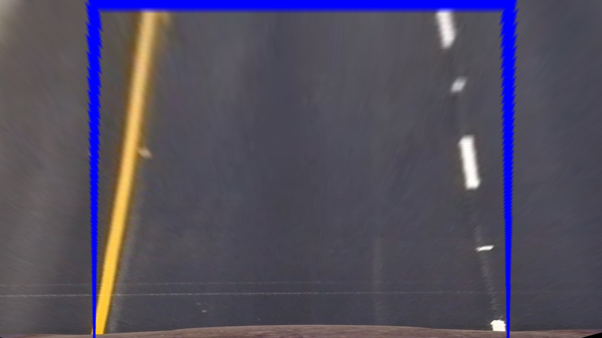

## Advanced Lane Finding
Software pipeline to identify the lane boundaries in a video.

#### Detailed Write-up
A detailed writeup is included as a python notebook 'WriteUp.ipynb' and an html version `WriteUp.html`. The html version should be able to run the embedded output video directly from the browser.

---

The goal / steps of this project are the following:

#### Camera calibration & Distortion correction
Compute the camera calibration matrix and distortion coefficients given a set of chessboard images.
Apply a distortion correction to raw images.

  

---

#### Thresholding
Use color transforms, gradients, etc., to create a thresholded binary image.

  

  

---

#### Perspective Transform: Bird's eye view
Apply a perspective transform to rectify binary image ("birds-eye view").

  

  

---

#### Fit lines to lane pixels
Detect lane pixels and fit to find the lane boundary.
Determine the *curvature* of the lane and vehicle position with respect to center.

  

  

---

#### Lines on original image
Warp the detected lane boundaries back onto the original image.
Output visual display of the lane boundaries and numerical estimation of lane curvature and vehicle position.

  

### Misc.
The images for camera calibration are stored in the folder called `camera_cal`.  
The video called `project_video.mp4` is the video used for the video pipeline. The labeled output of this video is `project_video_out.mp4`
